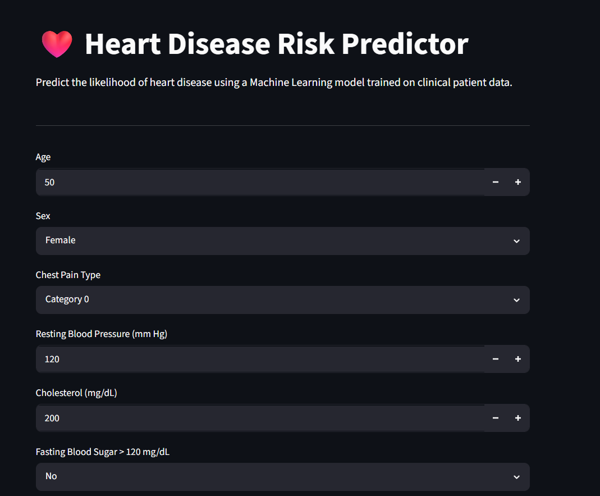
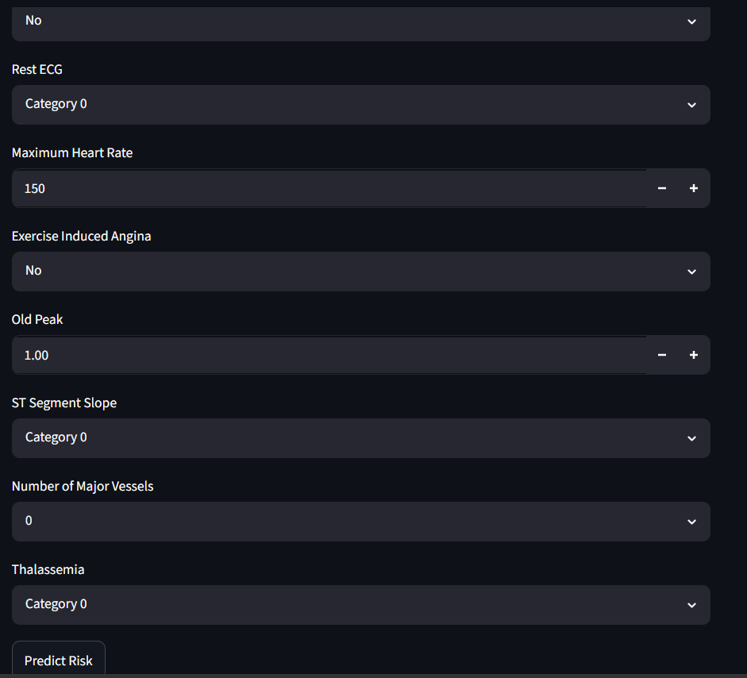
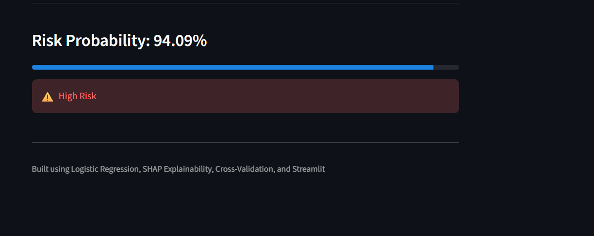
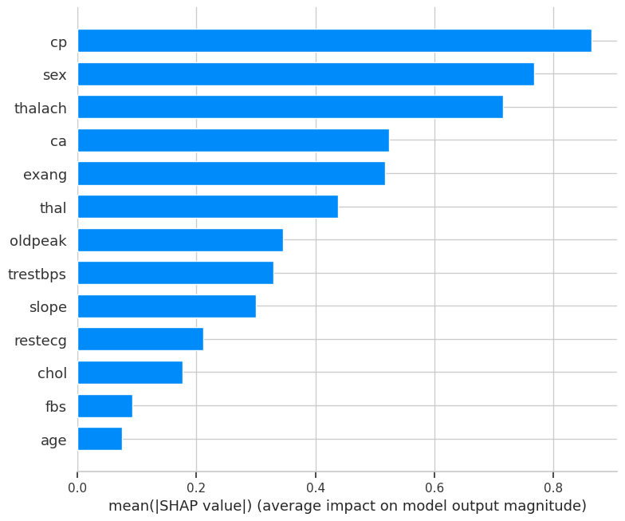
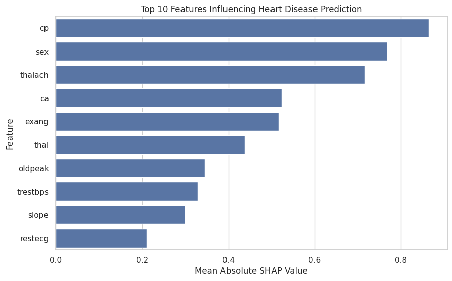

# ❤️ Heart Disease Risk Prediction System

## Overview

An end-to-end Machine Learning project that predicts the risk of heart disease using clinical patient data.

## Features

- Data Cleaning
- Duplicate Removal
- Statistical Hypothesis Testing
- Logistic Regression
- Random Forest
- XGBoost
- Cross Validation
- SHAP Explainability
- Streamlit Deployment

## Tech Stack

- Python
- Pandas
- NumPy
- Scikit-Learn
- XGBoost
- SHAP
- Streamlit

## Screenshots

### Home Page


### Input Form


### Prediction Result


### SHAP Feature Importance


### Feature Importance


## Results

| Model | Accuracy |
|---------|---------|
| Logistic Regression | 80.3% |
| Random Forest | 75.4% |
| XGBoost | 72.1% |

Best Model: Logistic Regression

## Key Findings

- Removed 723 duplicate records.
- Chest Pain Type was the most influential feature.
- Achieved ROC-AUC of 0.893 using 5-fold cross-validation.

## Run Locally

```bash
pip install -r requirements.txt
streamlit run app.py
```
